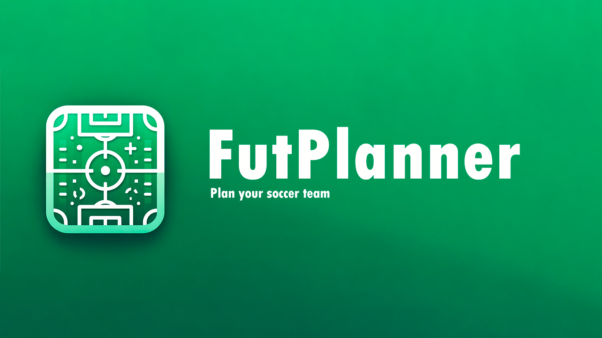
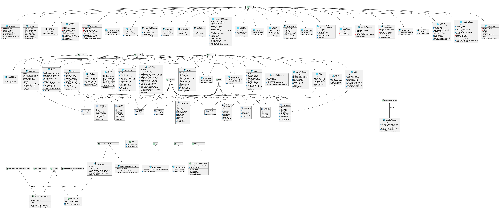

# FutPlanner 🏆⚽

## What is FutPlanner?

**FutPlanner** is an innovative iOS app designed for planning soccer matches and assessing player performance. Perfect for coaches, teams, and football enthusiasts, FutPlanner provides intuitive tools to organize games, manage players, and analyze statistics post-game.

## Key Features

- **Match Planning:** Easily organize matches by setting dates, locations, and times.
- **Team Management:** Manage your players by assigning positions and specific roles within the team.
- **Player Evaluation:** Track and analyze each player's performance with your detailed metrics and visual feedback.

## UML

## License

Distributed under non-comertial use. See `LICENSE` file for more information.

Pablo Rico

---
